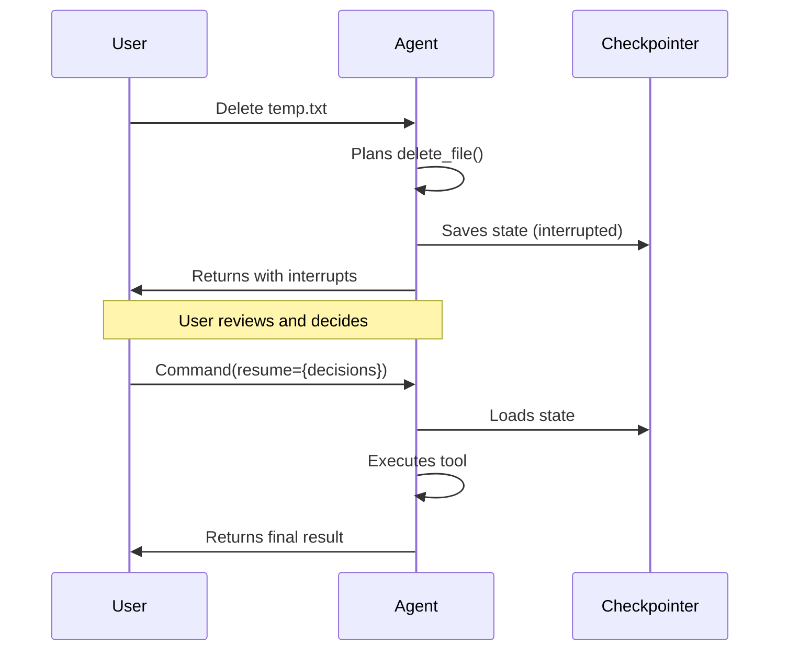

# Ticket: Human-in-the-Loop Integration with Nanobot Gateway

## Summary

Analyze how to integrate deepagents' human-in-the-loop (HITL) capabilities with nanobot's chat and gateway architecture, enabling approval workflows for sensitive tool operations across all channels (Telegram, WhatsApp, CLI, etc.).

## Reference Documentation

- **DeepAgents HITL Docs**: https://docs.langchain.com/oss/python/deepagents/human-in-the-loop
- **LangGraph Interrupts**: https://langchain-ai.github.io/langgraph/how-tos/human_in_the_loop/

## How DeepAgents HITL Works

### Interrupt Configuration
```python
agent = create_deep_agent(
    model=model,
    tools=[delete_file, write_file, execute],
    interrupt_on={
        "delete_file": True,  # Requires approval
        "write_file": {"allowed_decisions": ["approve", "reject"]},
        "execute": False,  # No approval needed
    },
    checkpointer=checkpointer,  # Required for HITL
)
```

### Interrupt Flow


### Interrupt Response Structure
```python
if result.interrupts:
    interrupt_value = result.interrupts[0].value
    action_requests = interrupt_value["action_requests"]
    # action_requests = [
    #     {"name": "delete_file", "args": {"path": "temp.txt"}}
    # ]
    
    decisions = [{"type": "approve"}]  # or "reject" or "edit"
    
    result = agent.invoke(
        Command(resume={"decisions": decisions}),
        config=config,  # Same thread_id!
        version="v2",
    )
```

## Current Nanobot Architecture

### Message Flow (Synchronous)
```
InboundMessage → DeepGateway._process_inbound() → DeepAgent.process() → OutboundMessage
```

### Key Components
- **MessageBus**: In-memory queue for inbound/outbound messages
- **DeepGateway**: Subscribes to inbound, processes with agent, publishes outbound
- **DeepAgent**: Wraps `create_deep_agent()`, handles message translation
- **Channels**: Telegram, WhatsApp, Discord, CLI, etc.

### Current Limitations
1. **Synchronous assumption**: Gateway expects one response per message
2. **No state persistence for interrupts**: No mechanism to store pending approvals
3. **No approval UI**: No way for users to approve/reject via channels
4. **Message format mismatch**: `InboundMessage`/`OutboundMessage` vs LangGraph interrupt structure

## Integration Challenges

### 1. Asynchronous Approval Flow
Current flow assumes immediate response. HITL requires:
```
Message 1: User asks to delete file
Response 1: "I need approval to delete temp.txt. Reply with 'approve' or 'reject'." 
Message 2: User replies "approve"
Response 2: "Done! Deleted temp.txt"
```

### 2. Cross-Channel Approval
Users may initiate on Telegram but need to approve on CLI, or vice versa.

### 3. Session State Management
Need to track:
- Pending interrupts per session
- Original thread_id for resumption
- Timeout for stale approvals

### 4. Multi-Tool Approval
When multiple tools need approval, need to present all options:
```
I want to:
1. delete_file("temp.txt") - [approve/reject]
2. send_email("admin@...", ...) - [approve/reject]
Reply with: 1a 2r (approve first, reject second)
```

## Proposed Solutions

### Option A: Inline Approval Commands

Transform interrupt into a conversational flow:

```python
# In DeepAgent.process()
result = agent.invoke(state, config, version="v2")

if result.interrupts:
    # Store interrupt state in checkpointer metadata
    pending = self._store_interrupt(result.interrupts[0], msg.session_key)
    
    # Return message asking for approval
    return OutboundMessage(
        channel=msg.channel,
        chat_id=msg.chat_id,
        content=self._format_approval_request(pending),
        metadata={"pending_approval_id": pending["id"]},
    )
```

User replies with command:
```
/approve delete_file
/reject send_email
```

Gateway intercepts approval commands and resumes agent:
```python
if msg.content.startswith("/approve"):
    pending = self._get_pending_interrupt(msg.session_key)
    decisions = self._parse_approval_command(msg.content, pending)
    result = agent.invoke(Command(resume={"decisions": decisions}), config)
    return translate_result_to_outbound(result, msg)
```

**Pros**:
- Works with all channels
- No protocol changes needed
- Familiar command pattern

**Cons**:
- Not as smooth as deepagents CLI
- Requires parsing commands
- Multi-tool approval UX is clunky

### Option B: Message Metadata Protocol

Extend `InboundMessage`/`OutboundMessage` with interrupt metadata:

```python
class InboundMessage(BaseModel):
    channel: str
    chat_id: str
    content: str
    metadata: dict = {}
    
    # New field for approval response
    approval_response: ApprovalResponse | None = None

class ApprovalResponse(BaseModel):
    interrupt_id: str
    decisions: list[Decision]

class OutboundMessage(BaseModel):
    channel: str
    chat_id: str
    content: str
    metadata: dict = {}
    
    # New field for approval request
    approval_request: ApprovalRequest | None = None

class ApprovalRequest(BaseModel):
    interrupt_id: str
    actions: list[ActionRequest]
    allowed_decisions: list[str]
```

Channels can implement native approval UIs:
- **Telegram**: Inline keyboard buttons
- **WhatsApp**: Interactive buttons
- **CLI**: Prompt with options

**Pros**:
- Clean separation of concerns
- Channels can implement native UX
- Structured data for tooling

**Cons**:
- Requires changes to nanobot-ai core
- More complex implementation
- Backward compatibility concerns

### Option C: Hybrid - Interrupt as Special Message

Keep message format, use content for structured data:

```python
# Agent returns interrupt
return OutboundMessage(
    channel=msg.channel,
    chat_id=msg.chat_id,
    content="",  # Empty content
    metadata={
        "type": "interrupt",
        "interrupt_id": "abc123",
        "actions": [
            {"tool": "delete_file", "args": {"path": "temp.txt"}},
        ],
        "allowed_decisions": ["approve", "reject"],
    },
)
```

Channels detect interrupt metadata and render appropriately:
- CLI shows prompt
- Telegram shows buttons
- WhatsApp shows quick replies

User response includes approval in metadata:
```python
InboundMessage(
    channel="telegram",
    chat_id="123",
    content="",  # or "approved" for text fallback
    metadata={
        "approval_response": {
            "interrupt_id": "abc123",
            "decision": "approve",
        }
    },
)
```

**Pros**:
- No changes to message schema
- Metadata already exists
- Backward compatible

**Cons**:
- Less type-safe
- Metadata overload

## Implementation Plan

### Phase 1: Core HITL Support
1. [ ] Add `interrupt_on` config to `DeepAgentsConfig`
2. [ ] Detect interrupts in `DeepAgent.process()`
3. [ ] Store interrupt state in checkpointer or separate storage
4. [ ] Implement approval command parsing (`/approve`, `/reject`)

### Phase 2: Gateway Integration
1. [ ] Modify `_process_inbound()` to handle approval commands
2. [ ] Implement interrupt state lookup and resumption
3. [ ] Add timeout for stale approvals
4. [ ] Test with CLI channel

### Phase 3: Channel-Specific UX
1. [ ] CLI: Interactive prompts with y/n options
2. [ ] Telegram: Inline keyboard buttons
3. [ ] WhatsApp: Quick reply buttons
4. [ ] Other channels: Text-based fallback

### Phase 4: Advanced Features
1. [ ] Multi-tool approval batching
2. [ ] Edit arguments before approval
3. [ ] Approval history/audit log
4. [ ] Configurable approval policies per channel

## Configuration Schema Changes

```python
class DeepAgentsInterruptConfig(BaseConfig):
    edit_file: bool = True
    write_file: bool = True
    execute: bool = True
    all_tools: bool = False
    
    # New: Fine-grained control
    allowed_decisions: dict[str, list[str]] = {}
    # e.g., {"delete_file": ["approve", "reject"]} - no edit allowed

class DeepAgentsConfig(BaseConfig):
    # ... existing fields ...
    
    interrupt_on: DeepAgentsInterruptConfig = Field(...)
    
    # New: Approval behavior
    approval_timeout: int = 300  # 5 minutes
    approval_fallback: Literal["reject", "approve", "ask"] = "reject"
```

## Test Scenarios

1. **Single tool approval**: User requests file deletion, approves via command
2. **Multi-tool approval**: User requests delete + email, approves one, rejects other
3. **Approval timeout**: Interrupt expires, agent receives rejection
4. **Cross-channel approval**: Start on Telegram, approve on CLI
5. **Edit before approval**: User modifies arguments before executing
6. **Subagent interrupt**: Tool inside subagent triggers approval

## Open Questions

1. **Approval timeout behavior**: Should we auto-reject, auto-approve, or ask again?
2. **Permission levels**: Can we configure who can approve? (admin-only operations)
3. **Approval history**: Where to store for audit? LangSmith? Separate DB?
4. **Concurrent approvals**: What if same user has multiple pending approvals?
5. **Channel capabilities**: How to handle channels without interactive UI?

## Related Files

- `nanobot_deep/agent/deep_agent.py` - Agent wrapper
- `nanobot_deep/gateway.py` - Message processing
- `nanobot_deep/langgraph/bridge.py` - Message translation
- `nanobot_deep/config/schema.py` - Configuration schema
- `tests/e2e/test_deepagent_live.py` - E2E tests

## Success Criteria

- [ ] Users can approve/reject tool calls via CLI
- [ ] Users can approve/reject via Telegram (buttons or commands)
- [ ] Multi-tool approval works correctly
- [ ] Timeouts are handled gracefully
- [ ] No approval state is lost between sessions
- [ ] Full audit trail available in LangSmith
